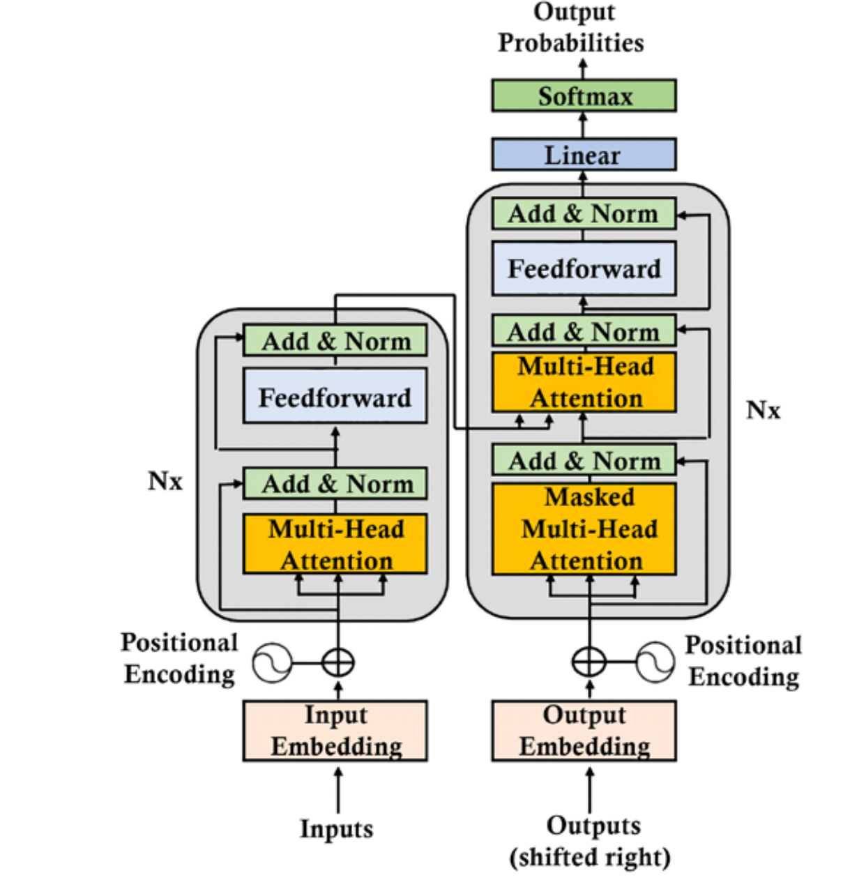

# **English-to-Arabic Transformer-Based Auto Translation Model**

[](https://opensource.org/licenses/MIT)
[](https://www.python.org/downloads/)
[](https://pytorch.org/)

This repository contains an implementation of a **Transformer-based English-to-Arabic translation model**. The model was built from scratch using **PyTorch** and is inspired by the seminal paper _[Attention is All You Need](https://arxiv.org/abs/1706.03762)_. It is designed to translate sentences from English to Arabic efficiently, leveraging the power of the Transformer architecture's self-attention mechanism.

The training process utilizes the **[yhavinga/ccmatrix](https://huggingface.co/datasets/yhavinga/ccmatrix)** dataset from the OPUS project, which provides high-quality parallel data for machine translation.

## **Table of Contents**

- [Project Overview](#project-overview)
- [Model Architecture](#model-architecture)
- [Dataset](#dataset)
- [Installation](#installation)
- [Usage](#usage)
- [Training](#training)
- [Evaluation](#evaluation)
- [Results](#results)
- [Visualizations](#visualizations)
- [Contributors](#contributors)
- [License](#license)

---

## **Project Overview**

### **Motivation**

The demand for effective, real-time translation systems has increased in our globalized world. Despite significant progress in natural language processing (NLP), Arabic, with its rich morphology and complex grammar, remains a challenging language to translate accurately. This project tackles that challenge by implementing a **Transformer model** that can efficiently handle **English-to-Arabic** translation using modern machine translation techniques.

---

## **Model Architecture**

The model is built from scratch, following the Transformer architecture introduced in _Attention is All You Need_. The Transformer outperforms previous architectures like Recurrent Neural Networks (RNNs) or Long Short-Term Memory (LSTMs) due to its ability to handle long-range dependencies and parallelize computations efficiently.

### **Key Components:**

- **Multi-Head Self-Attention:** Enables the model to focus on different parts of the input sequence simultaneously.
- **Positional Encoding:** Adds information about the relative position of words in the sequence since the model lacks inherent sequentiality.
- **Encoder-Decoder Architecture:** The encoder processes the source (English) sentence, and the decoder generates the target (Arabic) sentence.
- **Feedforward Layers:** Add depth to the model and provide non-linearity between attention layers.

### **Transformer Flowchart**

Below is a high-level overview of the model's architecture:



---

## **Dataset**

The **[yhavinga/ccmatrix](https://huggingface.co/datasets/yhavinga/ccmatrix)** dataset from **OPUS** is used to train and evaluate the model. It is one of the largest publicly available parallel corpora for English-Arabic language pairs. The dataset consists of bilingual sentence pairs extracted from web pages, providing a vast resource for training machine translation models.

### **Dataset Details**

- **Source:** OPUS (Open Parallel Corpus)
- **Languages:** English ↔ Arabic
- **Size:** ~59 million sentence pairs

### **Sample Data**

| English Sentence                                | Arabic Translation                                  |
| ----------------------------------------------- | --------------------------------------------------- |
| "This is a test sentence"                       | "هذه جملة اختبار"                                   |
| "Hello, how are you?"                           | "مرحبًا، كيف حالك؟"                                 |
| "This uncertainty was very difficult for them." | "كانت حالة عدم اليقين هذه صعبة للغاية بالنسبة لهم." |

---

## **Installation**

### **Step 1: Clone the Repository**

```bash
git clone https://github.com/mohamed22311/ARABISH-Transformer.git
cd english-to-arabic-transformer
```

### **Step 2: Install Dependencies**

```bash
pip install -r requirements.txt
```

### **Prerequisites**

- **Python 3.8+**
- **PyTorch 1.9+**
- **HuggingFace Datasets** for data loading
- **CUDA** (Optional for GPU training)

---

## **Usage**

You can either use the pre-trained model or train a new model from scratch. Here's a quick guide on how to translate an English sentence using the model:

```python
import torch
from config import get_config, latest_weights_file_path
from train.run_validation import run_validation
from dataset.dataset_loader import dataset_loader
from model.build_transformer import build_transformer
from translate import translate

# Define the device
device = torch.device("cuda" if torch.cuda.is_available() else "cpu")
print("Using device:", device)

config = get_config()

train_dataloader, val_dataloader, tokenizer_src, tokenizer_trg = dataset_loader(conf=config)

model = build_transformer(src_vocab_size=tokenizer_src.get_vocab_size(),
                          trg_vocab_size=tokenizer_trg.get_vocab_size(),
                          src_seq_len=config["seq_len"],
                          trg_seq_len=config["seq_len"],
                          d_model=config['d_model']).to(device)

# Load the pretrained weights
model_filename = latest_weights_file_path(config)
state = torch.load(model_filename)
model.load_state_dict(state['model_state_dict'])

# Translate an English sentence
english_sentence = "This is an example."
arabic_translation = translate(english_sentence)
print(f"Arabic Translation: {arabic_translation}")
```

For training and evaluation, refer to the following sections.

---

## **Training**

To train the model, simply run:

```bash
python train_model.py

```

### **Key Features:**

- **Optimizer:** Adam optimizer with weight decay.
- **Loss Function:** Cross-entropy loss applied to the target language tokens.
- **Learning Rate Schedule:** Cosine learning rate decay with warmup.
- **Early Stopping:** Based on validation loss.

Hyperparameters can be customized via the `config.py` file.

---

## **Evaluation**

To evaluate the model's performance on a test set, execute:

```python
from evaluate.evaluate_model_outputs import evaluate_model_outputs

evaluate_model_outputs(predicted=predicted,
                        expected=expected,
                        global_step=global_step,
                        writer=writer)
```

### **Evaluation Metrics:**

- **BLEU Score:** Widely used in machine translation tasks to measure the similarity between the generated translation and the reference.

- **Word Error Rate (WER):** WER evaluates the number of word-level errors between the generated translation and the reference translation. It's calculated as the ratio of the total number of substitutions, insertions, and deletions to the number of words in the reference.

- **Character Error Rate (CER):** CER is similar to WER but operates at the character level, measuring the number of character-level errors. It's particularly useful for languages like Arabic, where character-based evaluations can capture small but meaningful differences.

Sample Output:

```bash
BLEU Score: 28.5
WER: 22.4%
CER: 12.8%
```

- _BLEU Score:_ Measures the precision of n-grams.
- _WER:_ Lower scores indicate better performance (fewer word errors).
- _CER:_ Similarly, lower CER scores reflect better performance (fewer character-level errors).

---

## **Results**

The model trained only for 5 days on a poor GPU GTX 1650,
achieved only the following performance on the test set:

| Metric   | Score |
| -------- | ----- |
| **BLEU** | 13.5  |

It should be trained more on data, it didn't complete a single epcoh

### **Attention Weights Visualization**

The heatmap shows the attention weights from the self-attention mechanism, highlighting which words the model focuses on during translation can be shown by runing the notebook `attention_visuals.ipynb`

These visualizations help in understanding the model's learning dynamics and its attention to different parts of the input sentence.

---

## **Contributors**

- **Mohamed** - Senior Computer Engineering Student at Helwan University, Egypt.

Feel free to reach out if you have questions or suggestions!

---

## **License**

This project is licensed under the **MIT License**. See the [LICENSE](LICENSE) file for more details.
